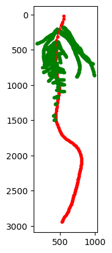

===============
Quick start
===============

Import necessay libray

.. code-block:: python

    import openalea.rsml as rsml
    from openalea.rsml.data import data_dir
    from openalea.rsml.plot import plot2d, plot3d

Read and convert rsml file to MTG
.. code-block:: python

    g = rsml.rsml2mtg(data_dir/'lupin_aero.rsml')

plot it in 2D

.. code-block:: python

    plot2d(g)  # requires matplotlib

